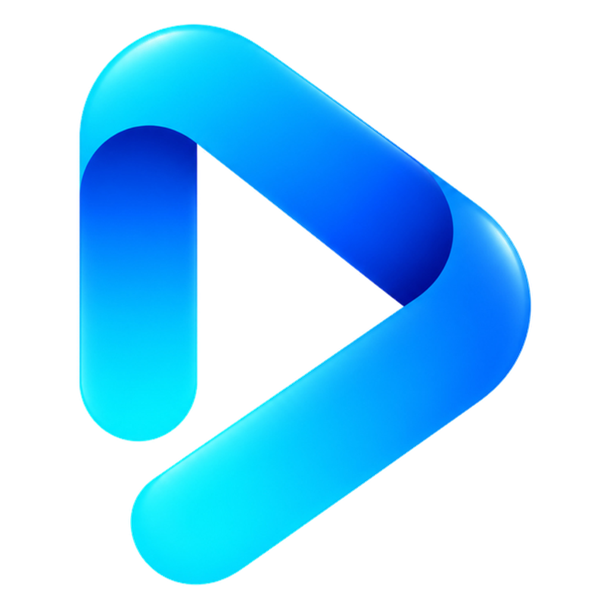

<p align="center">
  
</p>

<h1 align="center">Nextup</h1>

<p align="center">
  <strong>An independent, unofficial fork of <a href="https://github.com/varunsalian/debrify">Debrify</a></strong><br>
  The same media hub underneath, with a reworked interface, a Reels feed, cross-tracker sync, offline downloads, and per-commit iOS builds.
</p>

<p align="center">
  <a href="https://github.com/Alehaaaa/debrify/releases/latest"></a>
  <a href="https://github.com/Alehaaaa/debrify/releases"></a>
  <a href="https://github.com/Alehaaaa/debrify/commits/nextup"></a>
  
  <a href="LICENSE"></a>
</p>

<p align="center">
  <a href="https://github.com/Alehaaaa/debrify/releases/latest"><strong>Download</strong></a> &bull;
  <a href="#-whats-different-in-nextup">What's different</a> &bull;
  <a href="#-installation">Install</a> &bull;
  <a href="#-iphone--ipad-sidestore--altstore-source">SideStore source</a> &bull;
  <a href="https://github.com/Alehaaaa/debrify/issues">Issues</a>
</p>

> [!IMPORTANT]
> Nextup is a personal fork of Debrify maintained by [@Alehaaaa](https://github.com/Alehaaaa). It is **not** the official Debrify
> app and is not endorsed by or affiliated with the Debrify project. For the official app, go to
> [varunsalian/debrify](https://github.com/varunsalian/debrify) and [debrify.tv](https://debrify.tv/).
> Please report problems with Nextup **here**, not in the official Debrify channels.

---

## What is Debrify?

Debrify is an open-source, cross-platform **media hub** by Varun Salian and contributors. It brings the services you already use — cloud storage accounts, personal WebDAV servers, IPTV playlists, Stremio addon catalogs, YouTube — into one place, with a built-in player tuned for movies and TV, a download manager, Trakt/Simkl/MDBList tracking, and a UI that works on a phone, a desktop, or a TV with a remote.

Nextup keeps all of that and tracks upstream on the `nextup` branch, layering the changes below on top.

## ✨ What's different in Nextup

### 🎞️ Reels
- A vertical, swipeable **Reels** tab of official scene clips and trailers pulled from TMDB
- Clips start on arrival, the next one is prepared before you swipe, tap to pause, full-HD playback
- YouTube trailers resolve through a Cobalt relay on every platform (including iOS and tvOS), with the old low-res path as a fallback
- Share a reel, or jump straight from a clip to its title

### 📈 Tracking & sync
- **Continue Watching syncs across Trakt, Simkl and MDBList**, always moving to the furthest point you've reached on any of them
- Watch history and watchlists sync between trackers; local-only tracking still works offline
- **`debrify://episode` deep links** — apps like *Up Next for Trakt* can open a show directly at a given season and episode
- OMDb ratings and IMDb credits on title pages

### ⬇️ Downloads, offline-first
- Downloads rebuilt as one system: background downloads, one question to start, season/series scopes
- **Auto-download** with saved filters, including a codec filter
- A local library that opens fully **offline** — artwork, title pages and playback all work with no network or provider connected
- Radial progress on posters, and only downloaded episodes shown in the downloaded view

### 🎨 Interface
- A new app icon and splash animation
- **Looks** split into independent *Structure* and *Colour palette* choices; the player dock can follow the app colour or use its own
- Frosted-glass surfaces, glass search and navigation, refreshed fonts and motion
- Continuous swipe navigation between tabs
- **Hold / right-click menus on every card** across Home, Discover, Downloads and the calendar
- One detail page for every catalog title; *More Like This* and a Top 10 rail
- Customisable sidebar — reorder or hide sections, on desktop and phone

### ▶️ Player
- One loader for every stream; downloaded files skip the stream startup screen
- Double-tap the centre to play/pause, touch lock, pinch-to-fill framing
- Playback published to the OS media controls (lock screen, Control Center, media keys)

### ☁️ Backup & devices
- **WebDAV saved syncs** with snapshot versions you can roll back to
- Restoring a backup updates matching profiles instead of duplicating them
- An optional [Personal build](docs/PERSONAL_BUILD.md) that installs side by side with the normal app

### 🧹 Removed or hidden
- Upstream analytics removed
- Donation and support prompts removed
- Plain keyword (torrent) search and the catalog Sources picker hidden for now
- The in-app updater checks **Nextup's** releases

---

## 📱 Downloads

All builds are on the [**Releases**](https://github.com/Alehaaaa/debrify/releases) page. Grab the [latest release](https://github.com/Alehaaaa/debrify/releases/latest) unless you know you want an older one.

| Platform | File | Notes |
|:---------|:-----|:------|
| **Android** | `debrify-<version>-android.apk` | Phones and tablets |
| **Android TV** | `debrify-<version>-androidtv.apk` | Full D-pad and remote support |
| **Windows** | Installer | Windows 10/11 |
| **macOS** | DMG | Intel and Apple Silicon |
| **Linux** | AppImage | x86_64 and ARM64; needs dependencies ([see below](#linux)) |
| **iOS / iPadOS** | IPA | Unsigned, sideload — or use the [SideStore source](#-iphone--ipad-sidestore--altstore-source) |
| **Apple TV** | tvOS IPA | Unsigned, sideload |

Release builds are produced by GitHub Actions whenever a release is published. Already-installed copies on Android, Windows, macOS and Linux will offer the update in-app; on iPhone, iPad and Apple TV the app tells you to download and reinstall the new IPA.

---

## 🚀 Installation

### Android / Android TV
Download the APK from [Releases](https://github.com/Alehaaaa/debrify/releases/latest) and install it. On TV, use a file manager such as Downloader, or install over ADB.

### Windows
Run the installer and launch from the Start Menu. SmartScreen may warn on first run — click **More info → Run anyway**.

### macOS
Open the DMG and drag the app to Applications. The app isn't notarized, so the first time, right-click it → **Open**.

### Linux
```bash
# Dependencies (required)
# Ubuntu 24.04+
sudo apt install libmpv2 libsqlite3-dev libfuse2
# Ubuntu 22.04 / Debian
sudo apt install libmpv1 libsqlite3-dev libfuse2
# Fedora
sudo dnf install mpv-libs sqlite-devel fuse-libs
# Arch
sudo pacman -S mpv sqlite fuse2

chmod +x debrify-*.AppImage
./debrify-*.AppImage
```

### iOS / Apple TV
Download the unsigned IPA and sideload it with **SideStore**, **AltStore** or **Sideloadly** (Apple TV: Sideloadly or atvloadly). See the [iOS installation guide](docs/iOS-Installation.md).

> **Note:** Sideloaded apps with a free Apple account need re-signing every 7 days. SideStore and AltStore can do this automatically.

## 📲 iPhone & iPad: SideStore / AltStore source

Every commit to `nextup` builds an IPA and publishes it to a source, so new builds show up as updates inside SideStore or AltStore. Open **Sources → +** and add:

```
https://raw.githubusercontent.com/Alehaaaa/debrify/sidestore/apps.json
```

- Each build lists the commits since the previous one
- The source keeps the last 10 builds
- A new build only replaces the listed one once its IPA has finished uploading, so there's always an installable version
- The IPAs themselves live on the rolling [`ios-commits`](https://github.com/Alehaaaa/debrify/releases/tag/ios-commits) pre-release

These are untested commit builds — use a numbered [release](https://github.com/Alehaaaa/debrify/releases/latest) if you want something steadier. The older `releases/download/ios-commits/apps.json` URL is retired.

---

## Responsible Use

Debrify does not host, sell, provide, or bundle media content. Search sources, addons, indexers, WebDAV servers, IPTV playlists, and cloud accounts are user-configured integrations. Only use this app with content, services, and sources that you own, created, licensed, or are otherwise authorized to access.

Third-party plugins, addons, indexers, playlists, and services are controlled by their respective providers or users. Using any integration to infringe copyright or violate a provider's terms is not endorsed. See the upstream [Content Responsibility](https://debrify.tv/content-responsibility/) page for more detail.

---

## 🛠️ Building from source

```bash
git clone -b nextup https://github.com/Alehaaaa/debrify.git
cd debrify
flutter pub get
flutter run
```

```bash
flutter build apk --release               # Android
flutter build ios --release --no-codesign # iOS (unsigned)
flutter build windows --release           # Windows
flutter build macos --release             # macOS
flutter build linux --release             # Linux
```

TMDB metadata needs a read-access token passed at build time (`--dart-define-from-file`, with `TMDB_READ_ACCESS_TOKEN` and optionally `OMDB_API_KEY`); without it the app builds but metadata is disabled. To install a second copy alongside the normal one, see [Personal build](docs/PERSONAL_BUILD.md).

### Branches
- **`nextup`** — Nextup's main branch; upstream is merged in regularly
- **`sidestore`** — generated; holds the SideStore/AltStore source, don't commit to it

### A note on the code
Upstream is candid that this isn't a clean codebase: it grew around features rather than a planned architecture, with large files, static state and duplicated provider logic alongside newer, well-tested subsystems. That's still true here. [CODEMAP.md](CODEMAP.md) is a good place to start finding your way around.

---

## 🤝 Contributing & support

Bug reports and pull requests for **Nextup** are welcome on [Issues](https://github.com/Alehaaaa/debrify/issues). Changes that aren't specific to Nextup are often better sent [upstream](https://github.com/varunsalian/debrify) so everyone gets them.

Please don't take Nextup problems to the official Debrify Reddit or Discord — they don't support this build.

---

## 📄 License

Debrify is copyright © 2025–2026 Varun Salian and contributors. Nextup's changes are copyright © 2026 Alehaaaa.

The source code is free software under the [GNU Affero General Public License v3.0 only](LICENSE) (`AGPL-3.0-only`). If you distribute a modified or unmodified build, you must comply with the AGPL, including its corresponding-source requirements.

Third-party components and assets remain under their own licenses. The AGPL does not grant rights to the Debrify name or branding; see the upstream [Trademark Policy](TRADEMARKS.md).

<p align="center">
  <sub>Nextup — built with Flutter. Free and open-source software. Based on <a href="https://github.com/varunsalian/debrify">Debrify</a>.</sub>
</p>
